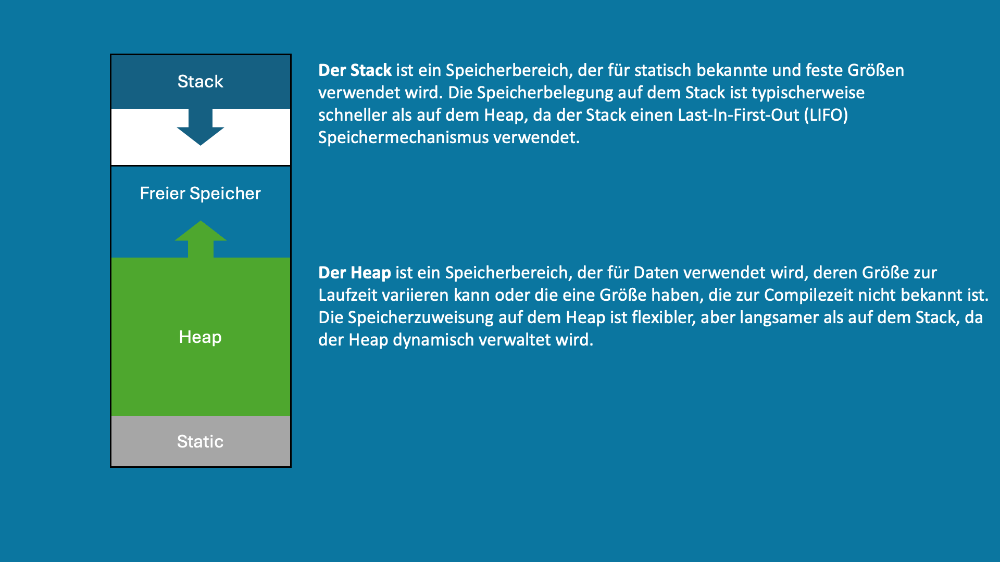
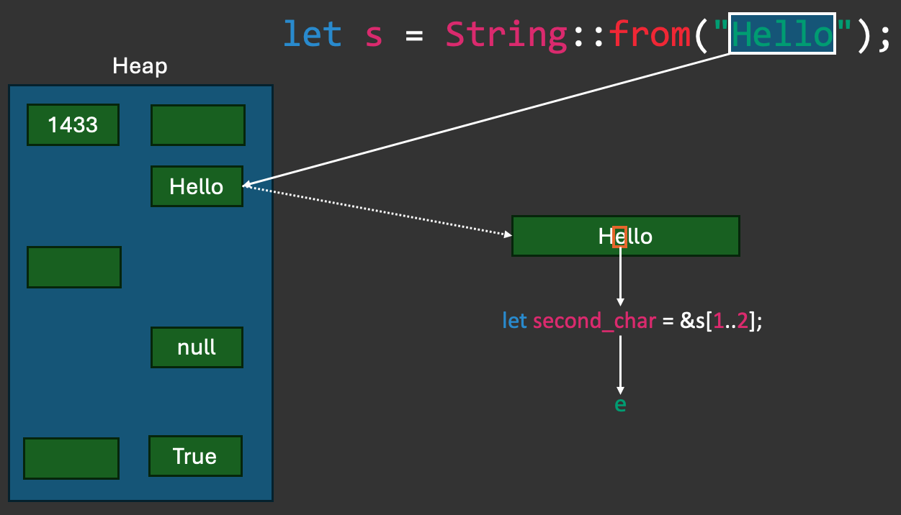

# Day 1 - Introduction to Rust

* Brief introduction to Rust
* Installation of Rust
* First program

## What is Rust and what advantages does it offer?

Rust is a modern programming language that focuses on security, speed and parallel execution. It was developed by Mozilla Research and first introduced to the public in 2010. Rust is meant to be a sort of successor to C and C++ by offering similar performance and control over system resources, but with a stronger focus on security and robustness.

Here are some of the key benefits of Rust:

### Memory safety

One of the main goals of Rust is to eliminate memory safety errors that are common in many other system programming languages. This is achieved through the ownership model, which ensures that each memory area has only one owner who is responsible for freeing the memory. This model prevents errors such as dangling pointers or race conditions, which can occur in languages such as C without careful programming and review.

### Concurrency without data races

Rust makes it possible to run multiple tasks in parallel without worrying about conflicts when accessing shared resources. Rust's ownership and type system ensures at compile time that unsafe states that could lead to data races are prevented.

### Performance

Rust is designed to provide performance comparable to C and C++. There is no garbage collection and little runtime checking, which means that Rust programs can be executed directly on the hardware and are suitable for near-system programming.

### Modern tooling

With Cargo, Rust offers an excellent package management and build system that manages dependencies, performs tests, generates documentation and much more. The Rust community also provides a large number of "crates" (packages) that are accessible via crates.io and accelerate development.

### Type system and pattern matching

Rust's type system is rigorous and helps catch many types of bugs at compile time. Pattern matching is a powerful feature of Rust that allows it to elegantly traverse and deconstruct complex data structures.

### Interoperability

Rust interoperates well with C and other languages, making it possible to integrate Rust code into existing projects or share libraries between languages.

### Active community

Rust has a very active and dedicated community. The language has been voted the "most popular language" among developers several years in a row, due in part to its friendly community and strong commitment to good development practices.

### Cross-Platform Development

Rust supports cross-platform development and can be used on a variety of operating systems and platforms.

These advantages make Rust an attractive choice for many projects, especially those where security and efficiency are critical, such as operating systems, game development, embedded systems and more.

## Installing Rust

We follow the official installation guide of Rust, which can be found at https://doc.rust-lang.org/book/ch01-01-installation.html.

As an IDE, we use VS Code as it provides good support for Rust and is one of the most popular IDEs for Rust. VS Code can be downloaded from https://code.visualstudio.com/.

In VS-Code we need the following extensions:

* rust-analyzer
* CodeLLDB (for MacOS and Linux)
* Microsoft C/C++ Extension (for Windows)

## First program

To create a new program with Rust, we use the Cargo tool (https://doc.rust-lang.org/book/ch01-03-hello-cargo.html), which is installed with Rust. Cargo is the build system and package manager for Rust and is used for most Rust projects.

To create a new project, run the following command:

```bash
cargo new hello_world
```

This command has created a folder with the name we specified.
It contains the following files:

* Cargo.toml - The configuration file for the project
* .gitignore - The file that lists the files and folders to be ignored by Git
* src/main.rs - The main file of the project

Cargo.toml:

```toml
[package]
name = "hello_world"
version = "0.1.0"
edition = "2021"

# See more keys and their definitions at https://doc.rust-lang.org/cargo/reference/manifest.html

[dependencies]
```

name - The name of the project  
version - The version of the project  
edition - The Rust edition to be used (2021 is currently the latest edition)

The dependencies of the project are also listed in the Cargo.toml file. We will see how to add dependencies later.

#### Executing the project - as a debug version

Before we can run the program, it must be built:

```bash
cargo build
```

This command creates an executable file in the target/debug/hello_world folder. We can execute this file:

```bash
./target/debug/hello_world
```

#### Creating a release build

To create a new program with Rust, we use the Cargo tool (https://doc.rust-lang.org/book/ch01-03-hello-cargo.html), which is installed with Rust. Cargo is the build system and package manager for Rust and is used for most Rust projects.

To create a new project, execute the following command:

```bash
cargo new hello_world
```

This command creates a folder with the specified name.
It contains the following files:

* Cargo.toml - The project's configuration file
* .gitignore - The file listing files and folders to be ignored by Git
* src/main.rs - The project's main file

| usize | Unsigned integer, size depends on architecture | let x: usize = 5; | 0 to 4,294,967,295 (32-bit) or 0 to 18,446,744,073,709,551,615 (64-bit) | 4 bytes (32-bit) or 8 bytes (64-bit) |
| f32 | 32-bit floating point number | let x: f32 = 5.0; | 1.2 * 10^-38 to 3.4 * 10^38 | 4 bytes |
| bool | Boolean | let x: bool = true; | true or false | 1 byte |
| char | Unicode character | let x: char = 'a'; | 0 to 1,112,064 | 4 bytes |
| str | String Slice | let x: &str = "Hello"; | | 2 bytes per character |

### Mutability - mut

Variables are immutable by default. To make a variable mutable, we use the mut keyword.

```rust
let x = 5;
x = 6; // Error: x is immutable
println!("The value of x is: {x}");
```

```rust
let mut x = 5;
x = 6; // OK
println!("The value of x is: {x}");
```

#### It was the heap of the moment

<center>
    
</center>

Before we look at strings, we need to familiarize ourselves with the heap and the stack. The stack is a memory area that is used at runtime to store variables and functions. The heap is a memory area that is used at runtime to store data whose size is not known at compile time or that can be changed at runtime.

<center>
    
</center>

### String and &str

There are two types of strings in Rust:  
`String` is a mutable data type in Rust that is allocated on the heap. This means that it can be resized at runtime, for example by appending more data to the end of the string.

`&str`, often referred to as a "string slice", is an immutable view into a string. An `&str` usually lives in the program's memory, which can include the statically allocated memory for literals, but it can also point to a part of a string or another &str. Since `&str` is an immutable reference (borrow), the content it points to cannot be changed.

```rust
// Create a mutable ``String`` object
let mut s1 = String::from("Hello");
// Append a string to `s1` with `push_str`
s1.push_str(", world!");
println!("The value of s1 is: {}", s1); // Output: The value of s1 is: Hello, world!

// Create an immutable string literal `&str`
let s2 = "Hello";
println!("The value of s2 is: {}", s2); // Output: The value of s2 is: Hello

// Convert a `&str` into a `String` object and modify it
let mut s3 = s2.to_string(); // or `let mut s3 = String::from(s2);`
// Append a string to `s3` with `push_str`
s3.push_str(", Rust!");
println!("The value of s3 is: {}", s3); // Output: The value of s3 is: Hello, Rust!

// Change `s3` by assigning a new value
s3 = "Goodbye, Rust!".to_string();
println!("The value of s3 is now: {}", s3); // Output: The value of s3 is now: Goodbye, Rust!
```

#### The nth element of a string

```rust
let s = String::from("Hello, world!");
let second_element = &s[1..2];

let hello = &s[0..5]; // or &s[..5]
let world = &s[7..12]; // or &s[7..]
println!("The value of hello is: {}", hello); // Output: The value of hello is: Hello
println!("The value of world is: {}", world); // Output: The value of world is: world
println!("The value of second_element is: {}", second_element); // Output: The value of second_element is: e
```

**And what happens with non-ASCII characters?**

```rust
let emoji_hell = String::from("👋🌎");
let second_element = &emoji_hell[1..2];
println!("The value of second_element is: {}", second_element); // Output: The value of second_element is: �
/*
byte index 1 is not a char boundary; it is inside '👋' (bytes 0..4) of `👋🌎`
*/
```

Problems can occur with non-ASCII characters, as these can occupy more than one byte. To solve this problem, we can use the `chars()` method to iterate over the characters of the string.

```rust
let emoji_hell = String::from("👋🌎");
let second_element = emoji_hell.chars().nth(1);
println!("The value of second_element is: {:?}", second_element); // Output: The value of second_element is: Some('🌎')
```



> **References:** In Rust, when we talk about parts of more complex data structures - such as strings - without cloning or modifying them, we usually use references. The & symbol creates such a reference. In the context of string slices, &s[1\..2] means the following:  
> s is a string whose content is stored in the heap.
> [1\..2] defines the range of the string that we want to capture. It specifies the start and end index of the desired slice. This particular example starts at index 1 and ends before index 2, which effectively selects the second byte of the string.\
> & before s[1\..2] tells Rust that we want a reference to the part of the string, not to copy the actual content itself. Creating a slice always creates a "borrowed" view of part of a string and does not give us ownership of the data.   We will go into more detail about references later.

# ? operator, option and result, unwrap and expect, match

## ? operator

The ? operator is an abbreviation for unwrapping option and result. It can only be used in functions that return option or result.

```rust
use std::fs::File;
use std::io;
use std::io::Read;

fn main() -> io::Result<()> {
    let mut f = File::open("hello.txt")?;
    let mut s = String::new();
    f.read_to_string(&mut s)?
    println!("The value of s is: {}", s);
    Ok(())
}
```

## Option and Result

Option and Result are enumerations defined in the Rust standard library. They are used to handle errors and other unexpected results.

### Option

Option is an enum that can be either Some(x) or None. Some(x) contains a value x, while None means that no value is present.

```rust
fn main() {
    let x = Some(5);
    let y: Option<i32> = None;
}
```

### Result

Result is an enum that can be either Ok(x) or Err(e). Ok(x) contains a value x, while Err(e) means that an error e has occurred.

```rust
use std::fs::File;
use std::io::Read;

fn main() {
    let f = File::open("hello.txt");
    let mut s = String::new();
    match f {
        // f == Ok(file)
        Ok(mut file) => {
            file.read_to_string(&mut s);
            println!("The value of s is: {}", s);
        }
        // f == Err(e)
        Err(e) => println!("Error: {}", e),
    }
}
```

## match

`match` is an expression that is used to compare a value with a series of patterns and then execute the code that matches the first matching pattern.

`.as_str()` converts a string into a string slice. (`&str`)  
`.to_string()` converts a string slice into a string. (`string`)

```rust
fn main() {
    let x = 5;
    match x {
        1 => println!("one"),
        2 => println!("two"),
        3 => println!("three"),
        4 => println!("four"),
        5 => println!("five"),
        _ => println!("something else"),
    }
}
```

```rust
fn main() {
    let x = 5;
    let y = match x {
        1 => "one",
        2 => "two",
        3 => "three",
        4 => "four",
        5 => "five",
        _ => "something else",
    };
    println!("The value of y is: {}", y);
}
```

### unwrap and expect

\`unwrap\` is a method that can be called on Option and Result. It returns the value if it is Some(x) or Ok(x), and triggers a panic if it is None or Err(e).

```rust
fn main() {
	let x = Some(5);
    let y = x.unwrap();
    println!("The value of y is: {}", y);
}
```

```rust
fn main() {
    let x = Some(5);
    let y = x.expect("Failed to unwrap x");
    println!("The value of y is: {}", y);
}
```

### Don't panic!

<center>
    
</center>

`panic!` is a macro that triggers an error and terminates the program. It can be triggered by `unwrap` and `expect`.

```rust
fn main() {
    panic!("Something went wrong");
}
```

Often functions in Rust return a value of type Result or Option. These types are used to handle errors and other unexpected results.

## Option + Unwrap

Option is an enum that can be either Some(x) or None. Some(x) contains a value x, while None means that no value is present.

```rust
fn main() {
    // second_element is of type Option<char>
    let mut second_element = emoji_hell.chars().nth(1);
    /*
    to get the value of second_element, we have to unpack it.
    */
    second_element = second_element.unwrap();
}
```

Unwraps are bad because they can trigger a panic if the value is None. Therefore, we should only use them if we are sure that the value is not None.

`panic!` is a macro that triggers an error and terminates the program. It can be triggered with `unwrap` and `expect`.


## Functions

Functions in Rust are declared with the keyword fn.

```rust
fn main() {
    println!("Hello, world!");
    another_one();
}

fn another_one() {
    println!("Biting dust...");
}
```

### Function parameters

Functions can have parameters that are specified in the signature of the function. The parameters are declared with the name and the type. The type can be omitted if it can be determined by the compiler.

```rust
fn main() {
    let x = 5;
    let y = 6;
    let z = add(x, y);
    println!("The value of z is: {z}");
}

fn add(x: i32, y: i32) -> i32 {
    x + y
}
```

**Note:** There are no named parameters in Rust, i.e. the order of the parameters is relevant.

### Statements and expressions

There are two types of code blocks in Rust: statements and expressions. Statements are instructions that execute an action but do not return a value. Expressions are code blocks that return a value.

```rust
fn main() {
    let x = 5; // Statement
    let y = { // Expression
        let x = 3;
        x + 1
    };
    println!("The value of y is: {y}");
}
```

### Return values

Functions can have a return value, which is returned with the keyword return. The return type is indicated with the arrow ->.

```rust
fn main() {
    let x = 5;
    let y = 6;
    let z = add(x, y);
    println!("The value of z is: {z}");
}

fn add(x: i32, y: i32) -> i32 {
    x++; // Error: x is invariant
    return x + y;
}
```

### Return values - without return

If a function does not have a return statement, the last expression in the function is used as the return value. The keyword return can therefore be omitted.

```rust
fn main() {
    let x = 5;
    let y = 6;
    let z = add(x, y);
    println!("The value of z is: {z}");
}

fn add(x: i32, y: i32) -> i32 {
    x + y
}
```

The `add` function has two parameters of type i32 and returns a value of type i32. The add function is called with the parameters x and y and the return value is assigned to the variable z.

### Return values - early termination

A function can also be terminated prematurely by using the keyword return without a value. In this case, the function is terminated without a return value.

```rust
fn main() {
    let x = 5;
    let y = 6;
    let z = add(x, y);
    println!("The value of z is: {z}");
}

fn add(x: i32, y: i32) -> i32 {
    if x > 5 {
        return x + y;
    }
    println!("x is not greater than 5");
}
```

## Shadowing and scope

Variables can be shadowed in Rust. This means that we can declare a new variable with the same name as an existing variable. The new variable then shadows the old variable, i.e. we can only access the new variable.

The scope is defined in Rust using curly brackets. Variables that are declared within a scope are only valid within this scope.

```rust
fn main() {
    let x = 5;
    let x = x + 1;
    let class_id = 1433;

    {
        
        let x = x * 2; // Shadowing   
        let y = 10;     
        let class_id = "Rust#1433"; // Error: class_id is already declared as i32
        println!("The value of x in the inner scope is: {x}"); // x is 12
        println!("The value of y in the inner scope is: {y}");
        println!("The value of class_id in the inner scope is: {class_id}");
    }

    println!("The value of x is: {x}"); // x is 6 again
    println!("The value of y is: {y}"); // Error: y is not in the scope
    println!("The value of class_id is: {class_id}"); // class_id is 1433 again
}
```

## Comments

Comments in Rust are written with // for single-line comments and /* */ for multi-line comments.

```rust
// Single line comment

/*
A comment
that spans several
lines
*/

let rice_corn_count = 100; // Number of rice grains


// Number of rice sacks
let sacks_of_rice = 20;
```

## Standard library

Rust's standard library provides a set of functions that can be used in any Rust program.
For our course, we will be working with the standard library frequently.
The most important functions are contained in the header of every Rust program:

```rust
use std::collections::HashMap;
use std::io;
...
```

### :: - Operator

The :: operator is used to access functions and types that are defined in a module. In this case, we access the functions and types defined in the standard library.

### Module - std

The standard library is divided into modules that contain different functions and types. The most important modules are:

* std::io - input and output
* std::collections - collections of data
* std::fs - file system
* std::net - network
* std::thread - Threads
* std::time - time

A module is a collection of functions and types defined in a file or folder. In Rust, modules are used to organize and structure code. Modules can also be used to hide code that is not intended for use outside the module.

A module is declared with the keyword mod. The code within the module is written in curly brackets {}.

```rust
mod my_module {
    // code
}
```

### Standard library - std::io

The standard library offers a range of functions for the input and output of data. The most important functions and macros (for us) are:

* println! - Outputs a line to the console
* print! - Outputs a line to the console
* read_line - Reads a line from the console

https://doc.rust-lang.org/std/io/struct.Stdin.html

```rust
use std::io;

fn read_food() -> io::Result<()>{
    let stdin = io::stdin();
    let mut food = String::new();


    println!("What is your favorite food?");
    // read_line() reads a line from the console and saves it in the variable food
    
    stdin.read_line(&mut food)?;
    // trim() removes spaces at the beginning and end of the string
    food = food.trim();

    // placeholders {} are replaced by variables
    println!("Your favorite food is {}", food);
    
    // Ok() returns an empty io::Result
    // ? returns the error, if one has occurred
    Ok(())
}
```

#### <()>

```rust
fn main() -> io::Result<()>{
    // code
    Ok(())
}
```

# Challenges
- pirate_name_generator(read_line)
- tip_me(read_line, basic arithmetic, )
- digit_sum(string slices, parse, Result)