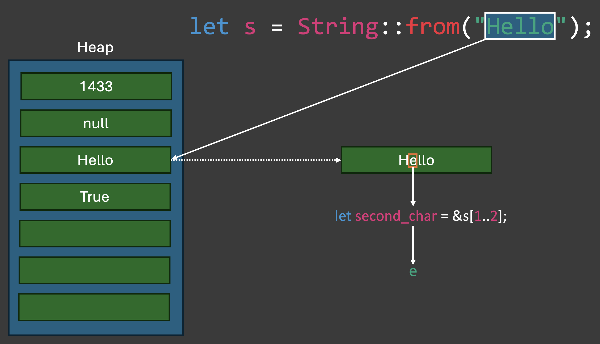

# Tag 1 - Einführung in Rust

* Kurze Einführung in Rust
* Installation von Rust
* Erstes Programm


## Was ist Rust und welche Vorteile bietet es?

Rust ist eine moderne Programmiersprache, die sich auf Sicherheit, Geschwindigkeit und parallele Ausführung konzentriert. Sie wurde von Mozilla Research entwickelt und erstmals im Jahr 2010 der Öffentlichkeit vorgestellt. Rust ist als eine Art Nachfolger von C und C++ gedacht, indem es eine ähnliche Leistung und Kontrolle über Systemressourcen bietet, aber mit einem stärkeren Fokus auf Sicherheit und Robustheit.

Hier sind einige der wichtigsten Vorteile von Rust:

### Speichersicherheit
Eines der Hauptziele von Rust ist es, Speichersicherheitsfehler zu eliminieren, die in vielen anderen Systemprogrammiersprachen üblich sind. Dies wird durch das Ownership-Modell erreicht, das sicherstellt, dass jeder Speicherbereich nur einen Besitzer hat, der für die Freigabe des Speichers verantwortlich ist. Dieses Modell verhindert Fehler wie dangling pointers oder race conditions, die in Sprachen wie C ohne sorgfältige Programmierung und Review entstehen können.

### Concurrency ohne Data Races
Rust ermöglicht es, mehrere Tasks parallel auszuführen, ohne sich Sorgen über Konflikte beim Zugriff auf gemeinsame Ressourcen machen zu müssen. Das Ownership- und Typsystem von Rust stellen zur Compile-Zeit sicher, dass unsichere Zustände, die zu sogenannten "data races" führen könnten, verhindert werden.

### Performance
Rust ist darauf ausgelegt, eine Leistung zu bieten, die mit C und C++ vergleichbar ist. Es gibt keine Garbage Collection und wenig Laufzeitüberprüfung, was bedeutet, dass Rust-Programme direkt auf der Hardware ausgeführt werden können und für systemnahe Programmierung geeignet sind.

### Modernes Tooling
Mit Cargo bietet Rust ein hervorragendes Paketmanagement- und Build-System, das Abhängigkeiten verwaltet, Tests durchführt, Dokumentation generiert und vieles mehr. Die Rust-Community stellt außerdem eine große Anzahl von "crates" (Paketen) zur Verfügung, die über crates.io zugänglich sind und die Entwicklung beschleunigen.

### Typsystem und Pattern Matching
Rusts Typsystem ist streng und hilft dabei, viele Arten von Fehlern zur Compile-Zeit zu fangen. Pattern Matching ist eine leistungsfähige Funktion von Rust, die es ermöglicht, auf elegante Weise komplexe Datenstrukturen zu durchlaufen und zu dekonstruieren.

### Interoperabilität
Rust kann gut mit C und anderen Sprachen zusammenarbeiten, was es ermöglicht, Rust-Code in bestehende Projekte zu integrieren oder Bibliotheken zwischen den Sprachen zu teilen.

### Aktive Community
Rust hat eine sehr aktive und engagierte Community. Die Sprache wurde mehrere Jahre in Folge zur "beliebtesten Sprache" unter Entwicklern gewählt, was unter anderem auf die freundliche Community und das starke Engagement für gute Entwicklungspraktiken zurückzuführen ist.

### Cross-Platform Development
Rust unterstützt Cross-Platform Development und kann auf einer Vielzahl von Betriebssystemen und Plattformen eingesetzt werden.

Diese Vorteile machen Rust zu einer attraktiven Wahl für viele Projekte, insbesondere solche, bei denen Sicherheit und Effizienz von entscheidender Bedeutung sind, wie Betriebssysteme, Spieleentwicklung, eingebettete Systeme und mehr.

## Installation von Rust

Wir halten uns an die offizielle Installationsanleitung von Rust, die unter https://doc.rust-lang.org/book/ch01-01-installation.html zu finden ist.

Als IDE verwenden wir VS-Code, da es eine gute Unterstützung für Rust bietet und eine der beliebtesten IDEs für Rust ist. VS-Code kann unter https://code.visualstudio.com/ heruntergeladen werden.

In VS-Code benötigen wir die folgenden Extensions:
* rust-analyzer
* CodeLLDB (für MacOS und Linux)
* Microsoft C/C++ Extension (für Windows)

## Erstes Programm

Um ein neues Programm mit Rust zu erstellen, verwenden wir das Cargo-Tool (https://doc.rust-lang.org/book/ch01-03-hello-cargo.html), das mit Rust installiert wird. Cargo ist das Build-System und Paket-Manager für Rust und wird für die meisten Rust-Projekte verwendet.

Um ein neues Projekt zu erstellen, führen Sie den folgenden Befehl aus:


```bash
cargo new hello_world
```

Dieser Befehl hat einen Ordner mit dem von uns angegebenen Namen erstellt.
Darin befinden sich folgende Dateien:

* Cargo.toml - Die Konfigurationsdatei für das Projekt
* .gitignore - Die Datei, die die Dateien und Ordner auflistet, die von Git ignoriert werden sollen
* src/main.rs - Die Hauptdatei des Projekts

Cargo.toml:
    
```toml
[package]
name = "hello_world"
version = "0.1.0"
edition = "2021"

# See more keys and their definitions at https://doc.rust-lang.org/cargo/reference/manifest.html

[dependencies]

```

name - Der Name des Projekts
version - Die Version des Projekts
edition - Die Rust-Edition, die verwendet werden soll (2021 ist aktuell die neueste Edition)

In der Datei Cargo.toml werden auch die Abhängigkeiten des Projekts aufgelistet. Wir werden später sehen, wie wir Abhängigkeiten hinzufügen können.

#### Ausführen des Projekts - Als Debug-Version
Bevor wir das Programm ausführen können, muss es gebaut werden:

```bash
cargo build
```

Dieser Befehl erstellt eine ausführbare Datei im Ordner target/debug/hello_world. Diese Datei können wir ausführen:

```bash
./target/debug/hello_world
```

#### Erstellen eines Release-Builds
Um eine optimierte Version des Programms zu erstellen, die für die Veröffentlichung bereit ist, führen wir den folgenden Befehl aus:

```bash
cargo build --release
```


## Variablen, Datentypen und Veränderbarkeit

### Deklaration und Initialisierung von Variablen
Variablen werden in Rust mit dem Schlüsselwort let deklariert. Der Typ der Variablen wird vom Compiler automatisch ermittelt.

```rust
let x = 5;
```

Alternativ können wir den Typ der Variablen auch explizit angeben:

```rust
let x: u8 = 5;
```

Hier einige der wichtigsten Datentypen in Rust:

| Typ | Beschreibung | Beispiel | Wertebereich | Größe |
| --- | --- | --- | --- | --- |
| i8 | Vorzeichenbehafteter 8-Bit-Integer | let x: i8 = 5; | -128 bis 127 | 1 Byte |
| i16 | Vorzeichenbehafteter 16-Bit-Integer | let x: i16 = 5; | -32.768 bis 32.767 | 2 Byte |
| i32 | Vorzeichenbehafteter 32-Bit-Integer | let x: i32 = 5; | -2.147.483.648 bis 2.147.483.647 | 4 Byte |
| i64 | Vorzeichenbehafteter 64-Bit-Integer | let x: i64 = 5; | -9.223.372.036.854.775.808 bis 9.223.372.036.854.775.807 | 8 Byte |
| i128 | Vorzeichenbehafteter 128-Bit-Integer | let x: i128 = 5; | -170.141.183.460.469.231.731.687.303.715.884.105.728 bis 170.141.183.460.469.231.731.687.303.715.884.105.727 | 16 Byte |
| isize | Vorzeichenbehafteter Integer, Größe abhängig von der Architektur | let x: isize = 5; | -2.147.483.648 bis 2.147.483.647 (32-Bit) oder -9.223.372.036.854.775.808 bis 9.223.372.036.854.775.807 (64-Bit) | 4 Byte (32-Bit) oder 8 Byte (64-Bit) |
| u8 | Vorzeichenloser 8-Bit-Integer | let x: u8 = 5; | 0 bis 255 | 1 Byte |
| u16 | Vorzeichenloser 16-Bit-Integer | let x: u16 = 5; | 0 bis 65.535 | 2 Byte |
| u32 | Vorzeichenloser 32-Bit-Integer | let x: u32 = 5; | 0 bis 4.294.967.295 | 4 Byte |
| u64 | Vorzeichenloser 64-Bit-Integer | let x: u64 = 5; | 0 bis 18.446.744.073.709.551.615 | 8 Byte |
| u128 | Vorzeichenloser 128-Bit-Integer | let x: u128 = 5; | 0 bis 340.282.366.920.938.463.463.374.607.431.768.211.455 | 16 Byte |
| usize | Vorzeichenloser Integer, Größe abhängig von der Architektur | let x: usize = 5; | 0 bis 4.294.967.295 (32-Bit) oder 0 bis 18.446.744.073.709.551.615 (64-Bit) | 4 Byte (32-Bit) oder 8 Byte (64-Bit) |
| f32 | 32-Bit Gleitkommazahl | let x: f32 = 5.0; | 1,2 * 10^-38 bis 3,4 * 10^38 | 4 Byte |
| f64 | 64-Bit Gleitkommazahl | let x: f64 = 5.0; | 2,3 * 10^-308 bis 1,7 * 10^308 | 8 Byte |
| bool | Boolean | let x: bool = true; | true oder false | 1 Byte |
| char | Unicode Zeichen | let x: char = 'a'; | 0 bis 1.112.064 | 4 Byte |
| str | String Slice | let x: &str = "Hello"; | | 2 Byte pro Zeichen |


### Veränderbarkeit - mut
Variablen sind standardmäßig unveränderlich. Um eine Variable veränderlich zu machen, verwenden wir das Schlüsselwort mut.

```rust
let x = 5;
x = 6; // Fehler: x ist unveränderlich
println!("The value of x is: {x}");
```

```rust
let mut x = 5;
x = 6; // OK
println!("The value of x is: {x}");
```
### String und &str
In Rust gibt es zwei Arten von Strings:  
`String` ist ein veränderlicher Datentyp in Rust, der auf dem Heap alloziert wird. Das bedeutet, dass er zur Laufzeit in der Größe verändert werden kann, indem man beispielsweise mehr Daten an das Ende des Strings anhängt.

`&str`, oft als "string slice" bezeichnet, ist eine unveränderliche Ansicht in einen String. Ein `&str` lebt in der Regel im Speicher des Programms, was den statisch allozierten Speicher für Literale einschließen kann, aber er kann auch auf einen Teil eines String oder eines anderen &str zeigen. Da `&str` ein unveränderlicher Verweis (borrow) ist, kann der Inhalt, auf den er zeigt, nicht verändert werden.

```rust
// Erstellen eines veränderlichen `String`-Objekts
let mut s1 = String::from("Hello");
// Anhängen eines Strings an `s1` mit `push_str`
s1.push_str(", world!");
println!("The value of s1 is: {}", s1); // Ausgabe: The value of s1 is: Hello, world!

// Erstellen eines unveränderlichen String-Literals `&str`
let s2 = "Hello";
println!("The value of s2 is: {}", s2); // Ausgabe: The value of s2 is: Hello

// Konvertieren eines `&str` in ein `String`-Objekt und Verändern
let mut s3 = s2.to_string(); // oder `let mut s3 = String::from(s2);`
// Anhängen eines Strings an `s3` mit `push_str`
s3.push_str(", Rust!");
println!("The value of s3 is: {}", s3); // Ausgabe: The value of s3 is: Hello, Rust!

// Verändern von `s3` durch Zuweisung eines neuen Wertes
s3 = "Goodbye, Rust!".to_string();
println!("The value of s3 is now: {}", s3); // Ausgabe: The value of s3 is now: Goodbye, Rust!
```

#### Das n-te Element eines Strings


```rust
let s = String::from("Hello, world!");
let second_element = &s[1..2];

let hello = &s[0..5]; // oder &s[..5]
let world = &s[7..12]; // oder &s[7..]
println!("The value of hello is: {}", hello); // Ausgabe: The value of hello is: Hello
println!("The value of world is: {}", world); // Ausgabe: The value of world is: world
println!("The value of second_element is: {}", second_element); // Ausgabe: The value of second_element is: e
```



> **Referenzen:** In Rust, wenn wir über Teile von komplexeren Datenstrukturen sprechen – wie etwa Strings –, ohne sie zu klonen oder zu verändern, verwenden wir in der Regel Referenzen. Das &-Symbol erstellt eine solche Referenz. Im Kontext von String-Slices bedeutet &s[1..2] folgendes:  
s ist ein String, dessen Inhalt im Heap gespeichert ist.
[1..2] definiert den Bereich des Strings, den wir erfassen möchten. Es gibt den Start- und den End-Index des gewünschten Slices an. Dieses spezielle Beispiel beginnt bei Index 1 und endet vor Index 2, was effektiv das zweite Byte des String auswählt.  
& vor s[1..2] sagt Rust, dass wir eine Referenz auf den Teil des Strings haben wollen, nicht den tatsächlichen Inhalt selbst kopieren. Das Erstellen eines Slices erzeugt immer eine "geliehene" Sicht auf einen Teil eines Strings und gibt uns keinen Besitz über die Daten.   Wir gehen später noch genauer auf Referenzen ein.


### Konstanten - const
Konstanten sind ähnlich wie Variablen, aber sie sind immer unveränderlich und müssen immer mit einem Typ deklariert werden. Konstanten können nur mit konstanten Ausdrücken initialisiert werden, d.h. sie können nicht zur Laufzeit berechnet werden.

```rust
const MAX_LIFE_POINTS: u32 = 100;
const MAX_DEFENSE_POINTS: u32 = 100;
const MAX_ATTACK_POINTS: u32 = 100;
const MAX_HIT_POINTS: u32 = MAX_LIFE_POINTS + MAX_DEFENSE_POINTS;
```

Konstanten unterscheiden sich in einigen Punkten von Variablen:

__Deklaration:__ Konstanten werden mit dem Schlüsselwort const deklariert und müssen immer einen Typ angeben.  
__Gültigkeitsbereich:__ Konstanten können in jedem Gültigkeitsbereich deklariert werden, einschließlich global für das gesamte Programm.  
__Ausdrücke:__ Konstanten müssen mit einem Wert initialisiert werden, der zur Kompilierzeit bekannt ist. Das bedeutet, dass sie keine Werte zugewiesen bekommen können, die erst zur Laufzeit bekannt sind.  
__Inline-Ersetzung:__ Konstanten werden vom Compiler direkt durch ihren Wert ersetzt, es findet also keine Speicheradressierung statt, wenn sie verwendet werden.

### Shadowing und Scope
Variablen können in Rust überschattet werden. Das bedeutet, dass wir eine neue Variable mit demselben Namen wie eine bereits vorhandene Variable deklarieren können. Die neue Variable überschattet dann die alte Variable, d.h. wir können nur noch auf die neue Variable zugreifen.

Der Scope, also Geltungsbereich wird in Rust durch geschweifte Klammern definiert. Variablen, die innerhalb eines Scopes deklariert werden, sind nur innerhalb dieses Scopes gültig.


```rust
fn main() {
    let x = 5;
    let x = x + 1;
    let class_id = 1433;

    {
        let class_id = "Rust#1433"; // Shadowing
        let x = x * 2;
        let y = 10;        
        println!("The value of x in the inner scope is: {x}"); // x ist 12
        println!("The value of y in the inner scope is: {y}");
        println!("The value of class_id in the inner scope is: {class_id}");
    }

    println!("The value of x is: {x}"); // x ist wieder 6
    println!("The value of y is: {y}"); // Fehler: y ist nicht im Scope
    println!("The value of class_id is: {class_id}"); // class_id ist wieder 1433
}
```

## Funktionen
Funktionen in Rust werden mit dem Schlüsselwort fn deklariert. 

```rust
fn main() {
    println!("Hello, world!");
    another_one();
}

fn another_one() {
    println!("Biting dust...");
}
```

### Funktionsparameter
Funktionen können Parameter haben, die in der Signatur der Funktion angegeben werden. Die Parameter werden mit dem Namen und dem Typ deklariert. Der Typ kann weggelassen werden, wenn er vom Compiler ermittelt werden kann.

```rust
fn main() {
    let x = 5;
    let y = 6;
    let z = add(x, y);
    println!("The value of z is: {z}");
}

fn add(x: i32, y: i32) -> i32 {
    x + y
}
```
> **Hinweis:** In Rust gibt es keine Named-Parmeter, d.h. die Reihenfolge der Parameter ist wichtig.

### Statements und Expressions
In Rust gibt es zwei Arten von Codeblöcken: Statements und Expressions. Statements sind Anweisungen, die eine Aktion ausführen, aber keinen Wert zurückgeben. Expressions sind Codeblöcke, die einen Wert zurückgeben.

```rust
fn main() {
    let x = 5; // Statement
    let y = { // Expression
        let x = 3;
        x + 1
    };
    println!("The value of y is: {y}");
}
```

### Rückgabewerte
Funktionen können einen Rückgabewert haben, der mit dem Schlüsselwort return zurückgegeben wird. Der Rückgabewert wird mit dem Pfeil -> angegeben.

```rust
fn main() {
    let x = 5;
    let y = 6;
    let z = add(x, y);
    println!("The value of z is: {z}");
}

fn add(x: i32, y: i32) -> i32 {
    x++; // Fehler: x ist unveränderlich
    return x + y;
}
```

### Rückgabewerte - ohne return
Wenn eine Funktion keinen Rückgabewert hat, wird der letzte Ausdruck in der Funktion als Rückgabewert verwendet. Das Schlüsselwort return kann weggelassen werden.

```rust
fn main() {
    let x = 5;
    let y = 6;
    let z = add(x, y);
    println!("The value of z is: {z}");
}

fn add(x: i32, y: i32) -> i32 {
    x + y
}
```

Die Funktion `add` hat zwei Parameter vom Typ i32 und gibt einen Wert vom Typ i32 zurück. Die Funktion add wird mit den Parametern x und y aufgerufen und der Rückgabewert wird der Variablen z zugewiesen.


### Rückgabewerte - frühes Beenden
Eine Funktion kann auch vorzeitig beendet werden, indem das Schlüsselwort return ohne einen Wert verwendet wird. In diesem Fall wird die Funktion ohne Rückgabewert beendet.

```rust
fn main() {
    let x = 5;
    let y = 6;
    let z = add(x, y);
    println!("The value of z is: {z}");
}

fn add(x: i32, y: i32) -> i32 {
    if x > 5 {
        return x + y;
    }
    println!("x is not greater than 5");
}
```

## Kommentare
Kommentare in Rust werden mit // für einzeilige Kommentare und /* */ für mehrzeilige Kommentare geschrieben.

```rust
// Einzeiliger Kommentar

/*
Ein Kommentar
der über mehrere
Zeilen geht
*/

let rice_corn_count = 100; // Anzahl der Reiskörner


// Anzahl der Reissäcke
let sacks_of_rice = 20;

```


## Standard Bibliothek
Die Standardbibliothek von Rust bietet eine Reihe von Funktionen, die in jedem Rust-Programm verwendet werden können. Die wichtigsten Funktionen sind in der Präambel jedes Rust-Programms enthalten:

```rust
use std::collections::HashMap;
use std::io;
...
```
### Standard Bibliothek - std::io
Die Standardbibliothek bietet eine Reihe von Funktionen für die Ein- und Ausgabe von Daten. Die wichtigsten Funktionen und Makros sind:

* println! - Gibt eine Zeile auf der Konsole aus
* print! - Gibt eine Zeile auf der Konsole aus
* read_line - Liest eine Zeile von der Konsole ein

```rust
use std::io;

fn main() {
    println!("Hallo, wie heißt du?");


    let mut input = String::new();
    io::stdin().read_line(&mut input);
    println!("You entered: {}", input);
}
```

## Challenge #1

